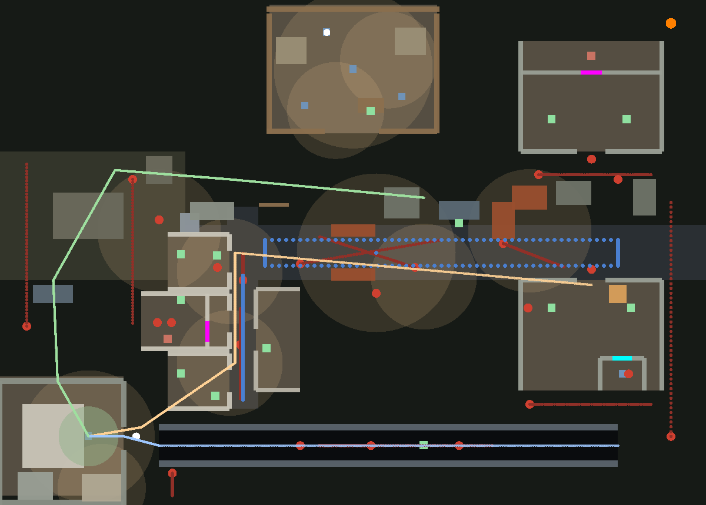

# 33 · 域外探索（长夜与八点 · 单夜切片）

> 与《Z年纪事》共享世界观：撬棍 / 核酸 / 机动队 / "现在大家都不出门"。
> 本作看夜晚，YZ 看白天；机制迁移（撬棍/核酸/机动队）直接复用语义。
> 本文是《长夜与八点》v0.2 设计文档在本仓库的技术落地稿。

- 版本 v0.1 · 2026-10-08
- 状态：单夜垂直切片已可玩（独立入口 `zone.html`）
- 关联：`doc/33` 本文件 · `src/zone/*` · `tests/zone.test.ts`

---

## 0. 什么叫"域外"

**域外 = 围墙外面、没有登记在册的城市。**

片区之内有编号、有回执、有核酸贴纸；出了墙，只有门牌和运气。
白天属于登记与核酸，夜晚属于撬棍与地道。每天晚上出门搜刮，天亮前回家，
**八点前排进核酸的队伍——这是你继续住在这个小区的唯一方式。**

与正传的关系（红线，同工坊隔离口径）：

| 项 | 正传《Z年纪事》 | 域外探索 |
| --- | --- | --- |
| 时段 | 白天（手续、回执、分类） | 夜晚（20:00 → 05:30） |
| 存档键 | `yoz.chapter1.v1` | `yoz.zone.v1`（严格隔离） |
| 主角 | 片区里的"你" | 同一条街、另一户的"你"（不共用身份） |
| 共享 | 撬棍 / 核酸 / 机动队 / 积木质感 | 同左 |
| 不共享 | 手枪、剧情旗帜、章节状态 | 同左（手枪在域外是**拒绝式选项**，在正传第一章是红线） |

---

## 1. 一句话与五支柱（沿用 v0.2，不动）

1. **避战优先**：能绕开的战斗就是赚到的战斗。每个敌人都是"地形问题"，不是"经验值"。
2. **时间即命**：两根钟永远在走。失败损失以时间与装备计，不删档。
3. **噪音即敌**：一切动作标价成"可被听见的动静"。
4. **拒绝式选择**：诱惑性坏选项永远提供，后果诚实兑现。
5. **文字层不撒谎**：HUD、任务、对白永远为真。假象只允许出现在画面与声音里。

---

## 2. 乐高化规格（本轮新增章节）

"物品任务都 lego 化"落到三条硬规格：

### 2.1 物品 = 一块积木

每件物品是一个**带凸点的积木件**，形状与颜色即属性表，不需要文字说明就能读出"它占多少地方"：

| 规格 | 规则 | 例 |
| --- | --- | --- |
| 占格 `w×h` | 直接决定背包里压住的格子数 | 撬棍 `1×3`、消防斧 `2×3`、绷带 `1×1` |
| 板厚 | `plate`（薄板）＝可堆叠的消耗品；`brick`（厚块）＝硬货；`rod`（长条）＝挥得动的；`tile`（光面板）＝纸片类 | 抗生素＝`plate`、手枪＝`brick`、钢管＝`rod`、通行条＝`tile` |
| 颜色 | 一路一色：**医疗＝白/红、电＝黄、食物＝橙、工具＝钢灰、证＝蓝、武器＝锈红/黑** | 电池＝黄 `1×1` |
| 凸点数 | 等于占格数（压缩显示），一眼读出"这东西多贵" | 消防斧 6 凸 |

背包是 **6×5 = 30 格**的底板。装不下就丢，**丢下的会留在原地**（地面积木件，可见、可回头捡）。

### 2.2 任务 = 一块挂牌

委托不是菜单条目，是**钉在委托板上的积木挂牌**（世界里也真有一块板）：

- 挂牌 = 底板 + N 个凸点；**颜色编码类别，凸点数编码分量**：
  - 🔴 红牌 2 凸 —— 药（抗生素，要 1 盒）
  - 🟡 黄牌 1 凸 —— 料（直撬棍，换回一根）
  - 🔵 蓝牌 1 凸 —— 人（南仓困着的人，看一眼就行）
- 接取 = 把挂牌从板子上**摘下来挂进自己的任务轨**；完成 = 把货带回定居点交货。
- **"现场带回"**：目标在世界里，不在菜单里。钥匙、路线、风险都由玩家自己解。

### 2.3 系统 = 看得见的积木

| 系统 | 画面层表现 | 文字层 |
| --- | --- | --- |
| 噪音 | 地面**积木涟漪环**（薄板围成的圆环，随半径长粗、变淡）；等级 = 环的大小与密度 | HUD 只报"刚才那一下是几级" |
| 光 | 路灯/灶火 = 地面暖色**光斑底板**（San 恢复点）；手电 = 锥形 | 电池百分比为真 |
| 三方互咬 | 机动队开枪 → 枪声环 → 丧尸循声涌入 → 尸体掉**积木件** | 战斗日志只记事实 |
| San 幻觉 | 画面里出现与真尸**同款**的半透明人仔 | HUD 的 San 数值永远为真，不替玩家判断"那是真的吗" |

---

## 3. 单夜切片规格

### 3.1 时钟

| 时钟 | 时刻 | 切片行为 |
| --- | --- | --- |
| 出门 | 20:00 | 从小区出发 |
| 宵禁 | 22:00 | 机动队见落单者**先警告，后开枪** |
| 出巢 | 23:00 | 东北快尸巢出 4 只快尸，惩罚晚归 |
| A · 天亮 | 05:30 | 视野倍增、躲藏失效；仍在街上 → **被记录，当日核酸作废** |
| 强制收摊 | 06:00 | 仍未到家 → 强制结算 |
| B · 核酸 | 08:00 | 到家后的最后一步（切片内以结局档案结算） |

时间压缩 **0.75 游戏分 / 现实秒** → 一夜 570 游戏分 ≈ **12.7 现实分钟**。

### 3.2 固定手排图（80 × 55 世界单位；1 单位 = 40 设计 px）



> 上图为交付图（由 `src/zone/zdata.ts` 的真实数据直接绘制，含建筑、容器、灯圈、
> 三条撤离路线、丧尸巡逻线与机动队航线）。

```
                    定居点（灶火 · 委托板 · 修械台 · 行军床）
                            ▲ 北
   西北野外 ─────────────────────────── 快尸巢(东北·23:00)
   （后墙缺口路线 C）        │
                     ── 主干道 · 哨卡 ──► 东
   商业街                   │                仓库 ×2
   便利店/药房/五金店        │              （重尸把守 · 消防斧 · 被困的人）
                            │
   小区·家 ◄── 正门（路线 A）│
        ◄── 后墙缺口（路线 B 地道出口）
                     ─── 地道（黑 · 伏地尸）──►
```

| 区位 | 地标 | 设计职能 |
| --- | --- | --- |
| 西南 | 小区（家） | 出生与终点；门廊灯 = 永远亮着的那盏 |
| 西 | 商业街三店 | 搜刮主课堂：便利店（伏尸与钥匙）、药房（钥匙经济 · 后库抗生素）、五金店（武器阶梯） |
| 北 | 难民定居点 | 安全区：委托板、修械台、灶火、行军床（KO 醒来点） |
| 中 | 主干道哨卡 + 巡逻队 | 路线选择的代价中心；警车残骸（拒绝式手枪） |
| 东 | 南北两仓 | 高风险高回报：重尸把守、消防斧、被困幸存者 |
| 南 | 地道 | 绕过哨卡的暗路：黑、慢、有伏地尸 |
| 东北 | 快尸巢 | 23:00 出巢，惩罚晚归 |

### 3.3 撤离路线表（本图实测距离，非设计文档通用表）

从南仓门口（27, 3.5）到家的三条路（航点即代码里的 `ROUTES`）：

| 路线 | 条件 | 风险 | 实测距离 | 航点 |
| --- | --- | --- | --- | --- |
| **A 大路 · 哨卡** | 通行条，或潜行钻探照灯死角 | 宵禁后极高 | **≈ 74 单位**（最短） | (27,3.5) → (-13.4,0) → (-13.4,12) → (-24,19) → 家 |
| **B 地道 · 南缘** | 手电 / 电池（摸黑也可，San 狂掉） | 黑暗 + 伏地尸，无机动队 | ≈ 77 单位 | (30,21) → (-22,21) → (-26,20) → 家 |
| **C 后墙缺口 · 野外** | 无 | 最长，绕行西北空地 | ≈ 100 单位 | (8,-6) → (-14,-8) → (-27,-9) → (-34,3) → (-33.5,14) → 家 |

A 线穿过哨卡中门（两根路障之间留 3.4 单位宽的缺口），B 线从南仓南侧下地道、
走完全黑的一整条走廊再爬出来，C 线从哨卡以北绕城墙外圈——三条路在图上是三种读法：
**赌一张纸 / 赌一节电池 / 赌一双腿。**

诚实记录：A 与 B 在本图上距离几乎相同——**地道不是更短，是更贵**（电池 + San + 伏地尸），
换来的是不用在哨卡面前赌一张纸。这是本图的实测值，不是设计文档通用表的照抄。

---

### 3.4 容器也占地方

货架 / 货箱 / 柜台 / 铁柜 / 工作台在碰撞层是真的（`CONTAINER_BOX`，见 zdata），
人和丧尸都不能从货架上穿过去；**伏尸不挡路**——他趴在地上，走近就能搜。

## 4. 系统参数（切片基线 = 设计文档第 9 节）

| 参数 | 取值 | 切片实现 |
| --- | --- | --- |
| 噪音半径 1–5 级 | 90/200/340/540/950 px | 2.25 / 5 / 8.5 / 13.5 / 23.75 单位 |
| 移动速度 潜/走/跑 | 74 / 138 / 218 px·s⁻¹ | 1.85 / 3.45 / 5.45 单位·s⁻¹ |
| 体力 | 100；疾跑 16/s、挥击 11/次、回复 11/s | 同 |
| 手电续航 | ≈ 7 现实分钟，换电池 +60% | 420 s，电池 +252 s |
| KO 惩罚 | 掉全部随身物 + 3 游戏小时 + San −20 | 同（240 现实秒） |
| 昏迷醒来点 | 定居点行军床 | 同 |
| 丧尸视距修正 | 潜行 ×0.55 / 疾跑 ×1.25 / 开手电 ×1.5 | 同；天亮后 ×2 |
| 时间压缩 | 0.75 游戏分/现实秒 | 同 |

### 4.1 丧尸（六种 + 幻觉体）

| 类型 | 速度 | 视距 | 职能 |
| --- | --- | --- | --- |
| 游荡者 | 1.55 | 9 | 噪音的听众；街道的背景辐射 |
| 快尸 | 4.60 | 13 | 23:00 出巢；惩罚晚归与无脑疾跑 |
| 蹲伏者 | 0（伏）→ 4.2 扑 | 4 | 惩罚贴墙抄近路 |
| 伏地尸 | 0（伏）→ 3.4 扑 | 3 | 惩罚搜刮与撬门的贪婪 |
| 叫尸 | 1.30 | 10 | 尖叫召集（噪音 4）；优先目标 |
| 重尸 | 1.05 | 6 | 活的地形：逼你改道，**不可战胜** |
| 幻觉体 | 2.10 | — | San < 45 出现，挥击永远落空 |

### 4.2 机动队

- **哨卡**：固定 2 人 + 探照灯扫动。
- **巡逻**：主干道 3 人组、商业街 2 人组，沿固定航线来回。
- **宵禁（22:00 起）**：见落单者**先警告一次，再见到就开枪**。
- **三方互咬**：见丧尸开枪 → 枪声（噪音 5）引来更多丧尸 → 被围死 → 战后掉落可捡（通行条 / 弹匣 / 绷带）。
- **清剿队**：任何枪声触发，25 秒后从图缘出发循声猎杀，**不警告**。

### 4.3 医疗两本账

- **失血**：咬伤留伤口，持续掉血；绷带止得住。
- **感染**：躯干深咬 → 90 秒倒计时；只有抗生素止得住。
- 绷带止不住感染，抗生素止不住血。

### 4.4 钥匙经济

- 药房后库（抗生素 ×3）← 钥匙在**便利店柜台后的伏尸**身上；撬门是永远的后门（噪音 3、耗耐久、惊动门后）。
- 北仓武器柜（消防斧）← 钥匙在**机动队战后掉落**或定居点交易；撬门同上。

### 4.5 拒绝式选择（切片内三个，全部诚实兑现）

| 出口 | 诱惑 | 兑现 |
| --- | --- | --- |
| 手枪 | 8 发，一枪一个 | 枪声 = 噪音 5 = 清剿队 + 全街丧尸循声 |
| 多拿一盒 | 后库有 3 盒，委托只要 1 盒 | 结算档案记"你多拿了 N 盒" |
| 照四十填 | 回家登记时照实写会更麻烦 | 结算档案记"登记与事实不符"，放逐计数不减 |

---

## 5. 一夜的建议走法（教学由地图承担）

1. **20:00** 出小区正门 → 商业街（搜刮主课堂，三店连着，噪音课在这里上）。
2. **21:00** 主干道：第一次看见机动队与丧尸互咬——**跟着队伍后面捡战场**。
3. **22:00** 宵禁后：哨卡开始真的开枪。
4. **22:30** 仓库区：重尸把守的门口，消防斧与被困的人（**救或绕开都只回声，不奖励数值**）。
5. **23:00** 快尸出巢 → 该决定了。
6. **23:30** 定居点：交货、包扎、修撬棍、喝口热的（San）。
7. **00:30 后** 选一条撤离路线回家；**05:30 前进家门**。

---

## 6. 切片范围（明确不覆盖）

- 不覆盖：程序生成器、多日存续、放逐计数持久化、白天实时流程。
- 覆盖：日循环完整一圈、找尸之旅（KO 一次即可体验）、双时钟与两种结局、一条撤离路线的抉择。

## 7. 验收问题

> **这一夜结束后，玩家想不想再来一夜？**

---

## 8. 已知边界（切片刻意从简）

- 无音效（后续按"夜里的声音即信息"再设计）。
- 包不会被他人翻动。
- 放逐计数不持久化，结局只在本夜档案里记一行。
- 幻觉体只在 San < 45 时出现，不做复杂演出。

---

## 9. 自动化验收

| 层 | 文件 | 覆盖 |
| --- | --- | --- |
| 内核不变量 | `tests/zone.test.ts`（38） | 双时钟 / 天亮与强制收摊 / 噪音半径与脚步 / 钥匙经济闭环 / 占格与负重 / 医疗两本账 / 找尸之旅 / 快尸出巢 / 重尸不可战胜 / 清剿队 / San 幻觉 / 委托现场带回 / 撤离路线表 / 地图硬约束（出生点、巡逻点、容器可达性） |
| 表现层无头冒烟 | `tests/zone-scene.test.ts`（9） | 每一件乐高物品、挂牌、噪音积木环、六种丧尸人仔都搭得出来；整张图建景 + 600 帧同步不抛异常、不产生 NaN 变换 |
| 页面接线 | `tests/zone-ui.test.ts`（9，jsdom） | 真实 `zone.html` 灌进 jsdom，注入不画东西的 renderer，真的跑帧循环：出门、走路掉体力、面板开关与暂停、天亮记录、到家结算、登记两个选项、再来一夜 |

交付环境没有 Chromium（沙箱下载不了），所以浏览器层用"注入 renderer + jsdom"替代，
不假称跑过 Playwright；`scripts/verify.mjs` 的域外探索流程留给 CI 的 e2e job。

## 10. 与正传共享的资产

`src/buildkit.ts` 的调色板与基础几何、`src/follow.ts` 的跟随逻辑（机动队编队复用）、
`src/style.css` 的面板与 HUD 样式——**域外探索不复制样式，直接引用**。
